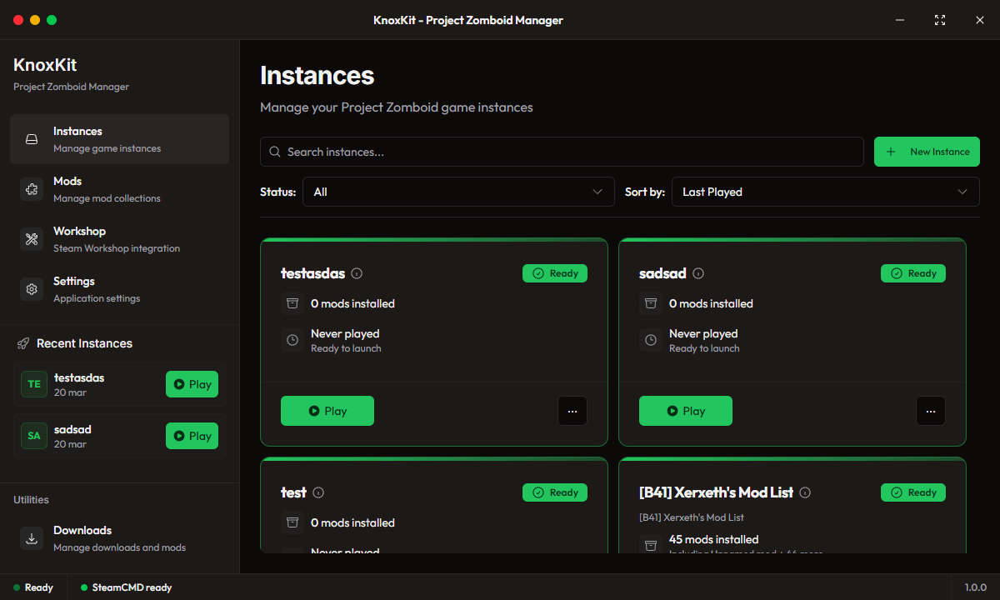

# KnoxKit 🧟 - Project Zomboid Instance Manager

    

> Outsmart the apocalypse, one instance at a time.

        

                <a href="https://github.com/valeriko777/KnoxKit/releases/tag/v1.0.0">
                                        
                                </a>
                                <a href="https://github.com/valeriko777/KnoxKit/issues">
                                        
                                </a>
                                <a href="https://github.com/valeriko777/KnoxKit/blob/main/LICENSE.md">
                                        
                                </a>
        

        <h3>🚀 Version 1.0.0 Now Available!</h3>
        
Basic functionality released. More features coming soon!

## 🎯 Overview
KnoxKit is a powerful and user-friendly instance manager for Project Zomboid that helps you manage multiple game configurations, mod collections, and system resources efficiently.

## ✨ Key Features
- **Instance Management**: Create, and manage multiple game instances
- **Steam Workshop Integration**: Seamless mod collection synchronization
- **Resource Optimization**: Smart resource allocation per instance
- **Modern UI**: Clean and intuitive interface with dark/light themes
- **Advanced Configuration**: Custom mod profiles and compatibility checks

## 🛠️ Technical Stack
- **Frontend**: Electron-Vite with React + TypeScript
- **Styling**: Tailwind CSS with Radix UI components
- **State Management**: Nanostores
- **Steam Integration**: SteamCMD (Anonymous access)

## 🔒 Security & Performance
- Instance sandboxing
- Resource usage monitoring
- Automatic performance optimization

## 🤝 Contributing
KnoxKit is in active development. Feel free to submit issues and pull requests.

## 📝 License
Licensed under Apache 2.0 with Commons Clause and Steam Workshop compliance. See [LICENSE.md](LICENSE.md) for details.

---
*KnoxKit is a community project and is not affiliated with The Indie Stone or Project Zomboid.*
